# Kunsthistorisches UZH Archivdatenbank #
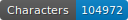 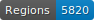 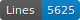 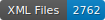
***

This dataset was created to experiment with the HTR and segmentation tools, [KRAKEN](https://github.com/mittagessen/kraken) and [YALTAi](https://github.com/PonteIneptique/YALTAi), on an atypical corpus: the archive of the Kunsthistorisches Institut in Zurich, which contains reproductions of works of art on which archivist's annotations and comments have been written. The objective is to find the most efficient method to extract this heterogeneous textual data. 
Indeed, the corpus contains several handwritten hands and different typographical fonts. Furthermore, different languages were used to annotate these reproductions: mostly German, Italian, and French. Finally, it is worth noting a large number of proper names and figures present on these documents. 

***

### The organisation of the repository is as follows: ###

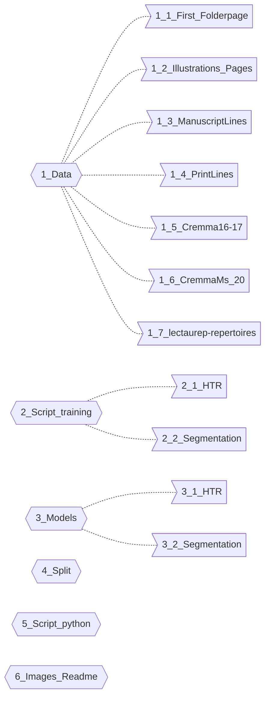

The data are organised in portfolios that allow them to be classified according to the origin of their content. We have chosen to divide our data with the first pages of the portfolio on one side and the pages containing the scanned illustrations on the other: this is to facilitate the training of the segmentation models; thus, we have created : 
- The folder [1_1_First_Folderpage](https://github.com/FoNDUE-HTR/FoNDUE_Kunsthistorisches-UZH_Archivdatenbank/tree/main/1_Data/1_1_First_Folderpage) with only the first pages (portfolios), which contain mainly handwritten lines;
- The folder [1_2_Illustrations_Pages](https://github.com/FoNDUE-HTR/FoNDUE_Kunsthistorisches-UZH_Archivdatenbank/tree/main/1_Data/1_2_Illustrations_Pages) with the pages containing the scanned illustrations. 

Thanks to the SegmOnto vocabulary we used, we created a python script (available in the [5_Script_python]() folder) in order to create two other files according to the types of writing: 
- [1_3_ManuscriptLines](https://github.com/FoNDUE-HTR/FoNDUE_Kunsthistorisches-UZH_Archivdatenbank/tree/main/1_Data/1_3_ManuscriptLines) with XML files where only handwritten lines are written.
- [1_4_PrintLines](https://github.com/FoNDUE-HTR/FoNDUE_Kunsthistorisches-UZH_Archivdatenbank/tree/main/1_Data/1_4_PrintLines) with XML files containing only printed lines.

These last two folders will evaluate the impact of writing changes in the training of HTR models.

## HTR Training ##

In view of evaluating the efficiency of each model, we divided our data for each writing type into three datasets (train, val, test), allowing respectively to train the model, evaluate the results at each epoch during the training, and then do a final test on the model with data it has never seen. The different sets of data are available in the 4_Split folder. 

Our Groundtruth consists of 559 portfolio pages "First_folderpage" and 548 pages with the reproductions "illustrations_pages". 
The scripts used to run the HTR training with Kraken are available in the [2_1_HTR](https://github.com/FoNDUE-HTR/FoNDUE_Kunsthistorisches-UZH_Archivdatenbank/tree/main/2_Script_training/2_1_HTR) folder. 

The table below shows the different results (accuracy by character) obtained during the different training sessions. All results in square brackets are those of the training tests, and all other results are those of the evaluation tests. The horizontal header corresponds to the name of the evaluation test set used, and the vertical header corresponds to the data sets used for the model training (in brackets, the name of the corresponding HTR model). The evaluation tests weren't performed when the training test results were too low. Issues 0
In order to obtain the best possible results, training was carried out by combining a dataset from the archives of the Kunsthistorisches Institut with those of other projects published on HTR-united: these are the repositories [1_5_Cremma16-17](https://github.com/HTR-United/cremma-16-17-print/tree/72df8652b600a0a23a09001f8814b6b2ff72c698) , [1_6_CremmaMs_20](https://github.com/HTR-United/CREMMA-MSS-20/tree/1b4a607b174d55fa8a7ab60013035bffdae4722b), [1_7_lectaurep-repertories](https://github.com/HTR-United/lectaurep-repertoires/tree/3d1c86cf5389265a1ce8b620301d36b4709eb435), with whom finestuning was carried out. 

| Evaluation test set ☞  HTR Model ☟                                                	| $$\color{Peach}{ManuscriptLines}$$ $$\color{Peach}{Firstfolderpages}$$	| $$\color{SpringGreen}{ManuscriptLines}$$ $$\color{SpringGreen}{Illustrationspages}$$ 	| **All  ManuscriptLines** 	| **All  PrintLines** 	| **ManuscriptLines  PrintLines + Illustrations_pages** 	|     **All**    	|
|----------------------------------------------------------------------------------------	|:---------------------------------------:	|:-----------------------------------------:	|:---------------------------:	|:----------------------:	|:--------------------------------------------------------:	|:--------------:	|
| **GT1 Firstfolderpage ( HTR_ManuscriptLines_4)**                                    	|             [97%] **93.74%**            	|                   7.53%                   	|            43.50%           	|         11.62%         	|                           9.43%                          	|     27.28%     	|
| **GT2 Manuscriptlines  + illustrations_pages (HTR_ManuscriptLines_5)**           	|                  89.03%                 	|               [80.8%] 80.30%              	|          **88.57%**         	|         18.38%         	|                          35.71%                          	|     52.68%     	|
| **GT3 All Manuscriptlines (HTR_ManuscriptLines_6)**                                 	|                **93.93%**               	|                   83.53%                  	|        [84.3%] 85.89%       	|         17.57%         	|                          33.02%                          	|     27.17%     	|
| **GT4 PrintLines (PrintLines_2)**                                                   	|                    //                   	|                     //                    	|              //             	|         [0.7%]         	|                            //                            	|       //       	|
| **GT5 illustrations_pages (illustrations_pages)**                                   	|                  12.32%                 	|   $$\color{SpringGreen}{85.34}$$  |            48.25%           	|         71.08%         	|                      [84.84%] 74.04%                     	|     59.84%     	|
| **GT6 All**                                                                            	|                **91.13%**               	|                   73.14%                  	|            82.16%           	|         52.84%         	|                          64.08%                          	| [80.7%] 70.56% 	|
| **GT7 ManuscriptLines  + Lectaurep-repertoires (HTR_ManuscriptLines+Lectaurep)** 	|                 [24.21%]                	|                     //                    	|              //             	|           //           	|                            //                            	|       //       	|
| **GT8 PrintLines  + Cremma16-17 (HTR_PrintLines+Cremma16-17)**                   	|                  32.66%                 	|                   33.47%                  	|            42.36%           	|       **67.84%**       	|                      [84.07%] 54.48%                     	|     50.55%     	|
| **GT9 All + Lectaurep-repertoires (AllLines+CremmaMs_20)**                          	|                **59.91%**               	|                   41.72%                  	|            54.87%           	|         33.92%         	|                          35.52%                          	| [42.94%]41.64% 	|
| **GT10 Illustrations_pages Binarisé  (illustrations_pages)**                        	|                    //                   	|                     //                    	|              //             	|           //           	|                         [36.34%]                         	|       //       	|
| **GT11 Illustrations_pages_Contrast  (illustrations_pages)**                        	|                  36.69%                 	|                   38.76%                  	|            35.87%           	|       **46.80%**       	|                      [49.71%] 44.97%                     	|     39.70%     	|

These different tests aimed to define whether it was preferable to train according to the type of writing (handwritten or printed); it should be noted that the printed lines use very heterogeneous typographical characters and that their number is less than that of the handwritten lines. Finally, it can be seen that training HTR models according to the type of handwriting does not considerably improve the HTR results: the model made with all handwritten lines obtains the best result allowed in all the tests performed, but it only performs very well on the handwritten lines of the portfolios (one hand only; accuracy per caracter : 93. 93%), and much less so on the handwritten lines of the documents with the reproductions (several hands; accuracy per caracter: 83.53%); whereas the model made with the training set (All) performs well on the different types of writing. 

## Segmentation ##

The segmentation of the corpus was carried out using the [SegmOnto](https://segmonto.github.io) controlled vocabulary. The SegmOnto zones used are : 

- `TitlePageZone` : for the first page of each portfolio (blau);
- `GraphicZone` : for illustrations (turquoise);
- `MarginTextZone` : for all text zones that are not in GraphicZone:illustration (purple);
- `NumberingZone` : for the numbering (orange).

    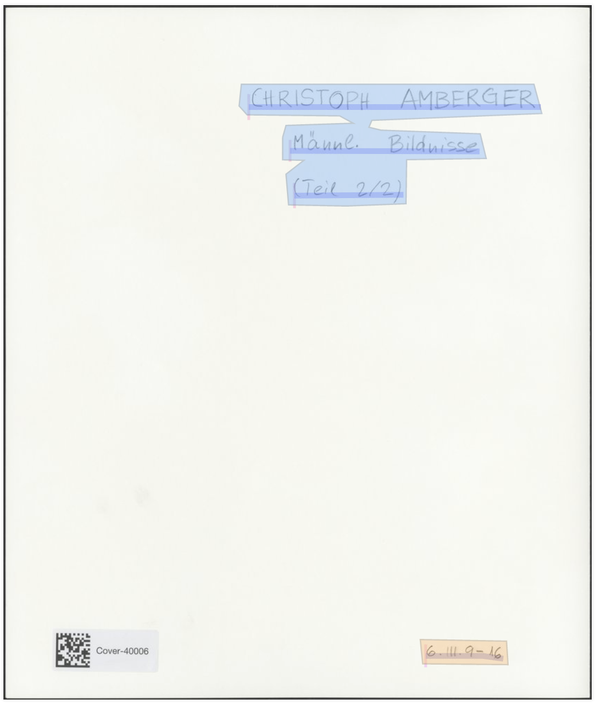
  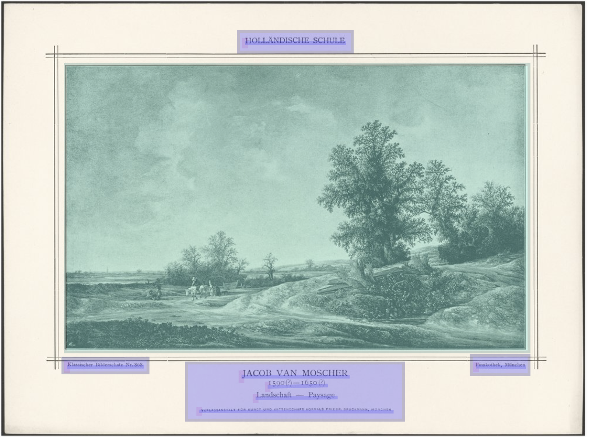
  

  
Concerning the lines, we have distinguished the manuscript lines from the typographic lines thanks to different sub-types; furthermore, to be able to differentiate the information contained in the headings from the rest, we have distinguished two types of lines (Heading und Default):

- `DefaultLine:manuscript`;
- `DefaultLine:print`;
- `HeadingLine:manuscript`;
- `HeadingLine:print`.

### Models ###

We first created two segmentation models according to the type of document to be segmented: portfolios ([First_Folderpage](https://github.com/FoNDUE-HTR/FoNDUE_Kunsthistorisches-UZH_Archivdatenbank/tree/main/1_Data/1_1_First_Folderpage)) and reproductions of works of art ([Illustrations_Pages](https://github.com/FoNDUE-HTR/FoNDUE_Kunsthistorisches-UZH_Archivdatenbank/tree/main/1_Data/1_2_Illustrations_Pages)); these two models result respectively is : 

- Segmentation First_Folderpage, average IOU (intersection over union) 42.78 %, frequency IOU 0.76;
- Segmentation Illustrations_Pages, average IOU 26.59 %, frequency IOU 0.89. 

It is no surprise that the results for the first few pages are better: that set is more regular and less complex. We then trained a segmentation model on all the data produced, which gave the following results: 

- Segmentation All, average IOU 44.17% IOU frequency 0.94.

There is a general improvement in results when all the data are trained together. 
Once this first observation was obtained, we decided to compare the results of the Kraken and YALTAi segmentation tools.  

Following the previous experiments, the YALTAi model was trained with the entire Groundtruth corpus. The results obtained are : 

- Average Accuracy 52.6 %
- Average Recall 36.5 %

To better compare the effectiveness of the models, we tried them both on the same corpus of images they had never encountered : 

|               | Khist_0175_I_000                          | Khist_0175_I_014_R                            |
|:-----------:  |:-----------------------------------------:    |:-----------------------------------------:    |
|  **KRAKEN**   |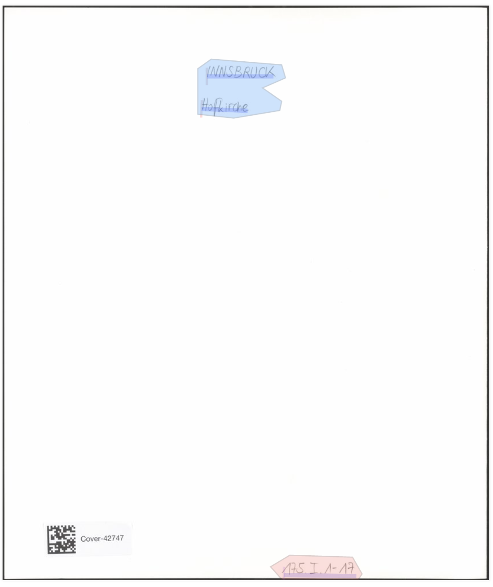|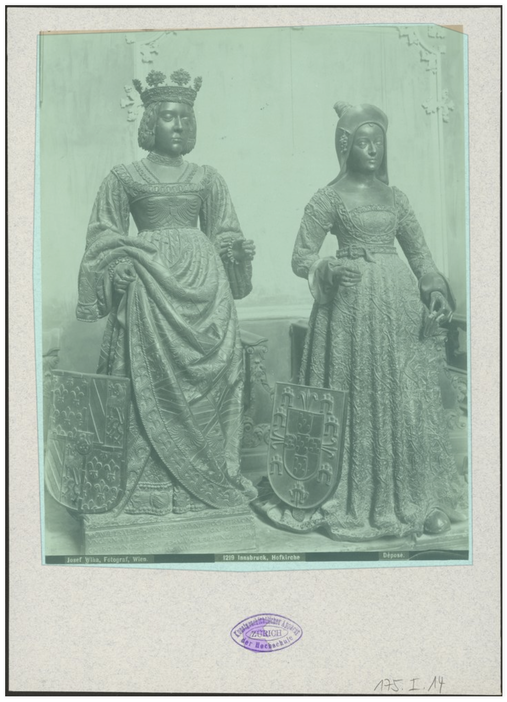                    |
| **YALTAi**    |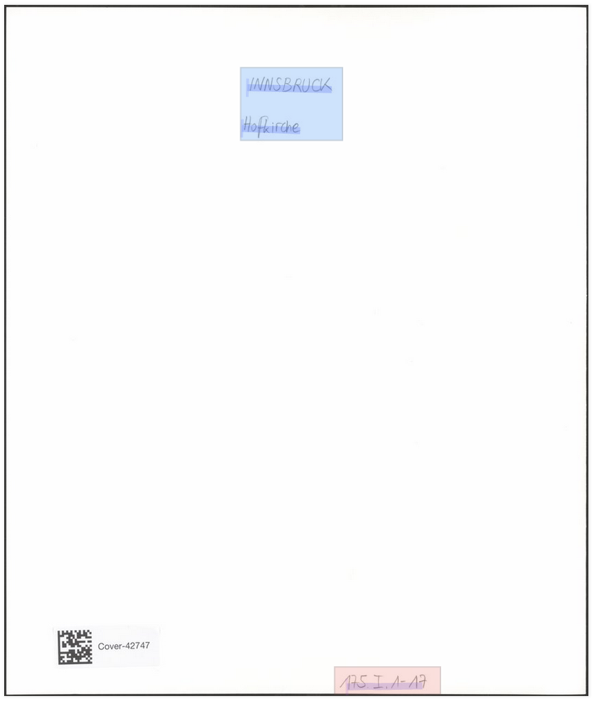 |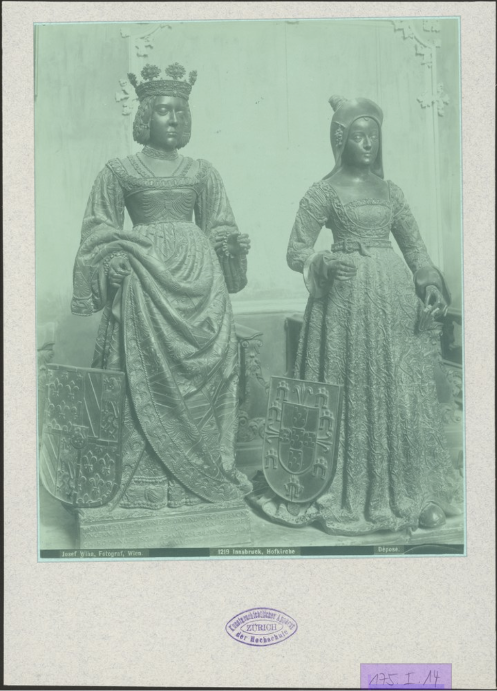|

  

The segmentation model made with YALTAi is more accurate and makes very few errors compared to the one made with Kraken. The segmentation model made with Kraken almost systematically forgets the NumberingZone and tends to add unwanted zones, which is not the case with the model made with the YALTAi tool. 

-----
## Bibliography ##

- Clérice, T. _You Actually Look Twice At it (YALTAi): using an object detection approach instead of region segmentation within the Kraken engine_, 2022. https://hal-enc.archives-ouvertes.fr/hal-03723208
- Gabay, S., Camps, J. -B., Pinche, A. & Carboni, N. _A Controlled Vocabulary to Describe the Layout of Pages_, version 0.9. In : Paris/Genève, 2021. https://github.com/SegmOnto
- Gabay, S., Kuenzli, P., Flacone, J-L., Charpilloz, C. _FoNDUE: Documentation, University of Geneva_, 2022. https://github.com/fonDUE-HTR/Documentation.
- Kiessling, B. "Kraken - a Universal Text Recognizer for the Humanities", _Digital Humanities Conference 2019_ DataverseNL, V2. In : Utrecht, The Netherlands, 2019. https://doi.org/10.34894/Z9G2EX, DataverseNL, V2
            Version used : 4. 2. 0, 2022. https://pypi.org/project/kraken/4.2.0/ 
-----   

## E-mail ##

Feel free to contact me if you have any questions or need more information about this depot : [pauline.jacsont@unige.ch](mailto:pauline.jacsont@unige.ch)
